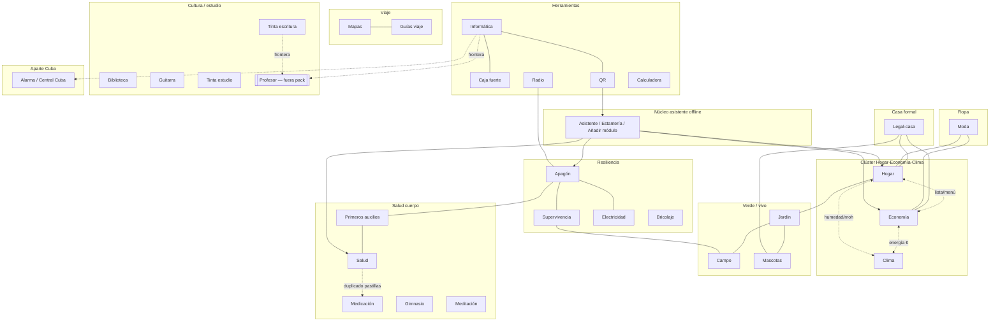

# Mapa sintético de relaciones

Unifica `inventario.md`, `solapes.md`, `huecos.md`, `puentes.md`.  
29 módulos únicos · 5 aliases · Cuba aparte · Ruleta/red/juego fuera de alcance.

---

## Diagrama (Mermaid)

---

## Tabla clúster × módulo

| Clúster | Módulos | Solape fuerte | Hueco / tensión | Puente prioritario |
|---|---|---|---|---|
| Hogar-€-Clima | Hogar, Economía, Clima | Compra/menú; termostato/€ | Doble lista compra | P1 lista unificada; P3 hábitos energía |
| Verde | Jardín, Campo, Mascotas | Toxicidad; supervivencia plantas | Vet en apagón | Deep-link toxicidad |
| Salud | Salud, Medicación, Auxilios, Gym, Medita | Pastillas duplicadas | Fuente de verdad | P2 Medicación→Salud |
| Resiliencia | Apagón, Supervivencia, Campo, Elec, Radio | Corte luz / agua / 112 | Radio no offline audio | Hub Resiliencia 3 chips |
| Legal-€ | Legal, Economía, Hogar | Derramas, vivienda | IRPF no cubierto | Derrama→gasto |
| Ropa | Moda, Hogar, Economía | Lavado/manchas | — | Etiqueta `lavado` |
| Herramientas | Info, Caja, QR, Radio, Calc | Secretos / catálogo | Cuba en Info vs home | QR ids canónicos |
| Viaje | Mapas, Guías | Ciudad Va | Guías esqueleto en modulos/ | CTA pack cruzado |
| Cultura | Biblio, Guitarra, Tintas, Info | Frontera Profesor | Plantilla 1 KB en modulos | No mezclar estantes |

---

## Conteos

- HTML en `modulos/`: 34  
- Únicos: **29**  
- Aliases: **5**  
- LEEME: 28 (+ vida sin HTML)  
- Docs carpeta: HOGAR-INDICE, _aparte-cuba  

## Top 5 solapes
1. Hogar ↔ Economía (compra/menú/nevera)  
2. Economía ↔ Clima (energía/confort)  
3. Moda ↔ Hogar (lavado/manchas)  
4. Salud ↔ Medicación (pastillas)  
5. Apagón ↔ Electricidad ↔ Supervivencia  

## Top 5 huecos
1. Fontanería / gas / pintura (LEEME-vida)  
2. Lista compra no unificada  
3. Duplicado Salud/Medicación  
4. Guías viaje esqueleto en modulos/  
5. Agenda personal inexistente en estantería  

## 3 puentes prioritarios
1. Lista compra Hogar↔Economía  
2. Medicación como fuente → Salud  
3. Hábitos energía Clima↔Economía  

*Fin mapa.*
