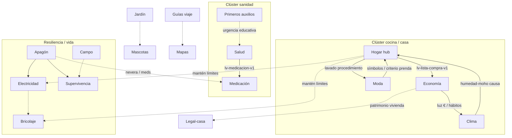

# Mapa de relaciones — síntesis

Fecha: 26 sep 2026 · Europe/Madrid (UTC+2)

## Diagrama (Mermaid)

## Tabla síntesis relaciones

| De | A | Tipo | Evidencia |
|----|---|------|-----------|
| Hogar | Economía | dato compartido | `lv-lista-compra-v1` |
| Hogar | Clima | contenido puente | moho/humedad vs limpieza |
| Hogar | Moda | contenido parcial | lavado ↔ cuidado |
| Hogar | Electricidad/Bricolaje | límite | mantén «llamar profesional» |
| Economía | Clima | frontera € vs confort | tabs `luz` vs lecciones clima |
| Economía | Legal-casa | puente | patrimonio / impuestos Va |
| Salud | Medicación | dato compartido | `lv-medicacion-v1` |
| Apagón | Electricidad | enlace declarado | LEEME-apagon |
| Apagón | Supervivencia | tema afín | corte / stock |
| Campo | Supervivencia | frontera outdoor/casa | LEEME-campo |
| Jardín | Mascotas | aviso toxicidad | diccionario jardín |
| Guías | Mapas | viaje ES | piloto + packs |
| Informática | Aparte Cuba | aparte | `_aparte-cuba.md` |

## Densidad por clúster

| Clúster | Núcleo denso | Satélites finos |
|---------|--------------|-----------------|
| Casa | Hogar, Economía, Jardín | Clima, Moda, Legal, Bricolaje, Electricidad |
| Salud | — | Salud, Medicación, PA, Gimnasio*, Meditación* |
| Cultura | Biblioteca, Informática | Tintas, Guitarra, Guías, QR |
| Resiliencia | — | Apagón, Supervivencia, Campo, Radio, Mapas |

\*Gimnasio/Meditación son densos pero de bienestar, no solapan datos con Salud.

*Fin mapa*
